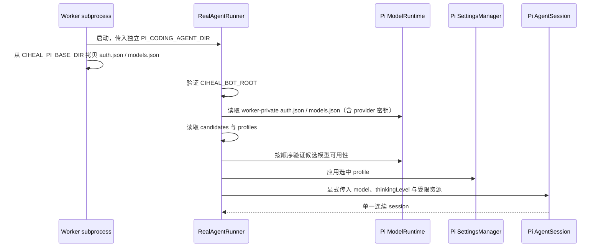

# Pi Agent Configuration

本文描述 CI 自愈 bot 当前如何创建、隔离与约束 Pi agent。它是运行时行为说明，不取代 [`CONTEXT.md`](../CONTEXT.md) 的术语定义和 [ADR-0001](adr/0001-bot-owned-pi-runtime.md) 的架构决策。

## 1. 目标与边界

bot 使用 Pi agent 诊断失败的单元测试，并仅允许其处理测试或相关文档。Pi 配置必须由 bot 发布包控制，而不能由被修复项目、目标分支或宿主机用户目录控制。

明确不支持：

- 从目标 worktree 加载 `.pi/**`、`.agents/skills/**`、`SYSTEM.md`、扩展、主题或 context 文件；
- 依据目标项目配置切换 provider、模型、thinking 或工具集；
- 在 session 已开始后切换 provider/model 或重放工具操作；
- 用 bot 配置覆盖 Pi model catalog 中的 `contextWindow`、`maxTokens` 或 reasoning 能力。

## 2. 配置所有权与文件布局

部署必须设置绝对路径 `CIHEAL_BOT_ROOT`。它指向完整的 bot 发布目录，至少应包含：

```text
$CIHEAL_BOT_ROOT/
├── .pi/
│   └── settings.json
├── src/agents/ci-repair/resources/
│   ├── APPEND_SYSTEM.md
│   └── skills/ci-self-heal-playbook/
│       ├── SKILL.md
│       └── references/
└── config/
    └── model-candidates.json
```

`RealAgentRunner` 会验证 `CIHEAL_BOT_ROOT/config` 和 bundled playbook 存在；缺失时 session 初始化失败并升级人工，而不是从目标 worktree 或用户全局目录寻找替代配置。

部署还必须设置绝对路径 `CIHEAL_PI_BASE_DIR`。这是 deployment-owned 的只读目录，包含 Pi 原生格式的 `auth.json`、`models.json` 或两者。`auth.json` 必须由 Secret Manager/secret volume 提供，绝不能打入 release 或提交到 git。

注意：**provider 列表内置于 Pi SDK**（`@earendil-works/pi-ai/providers/all` 的 `builtinProviders()`，含 deepseek/openai/anthropic/qwen 等约 40 个）。因此默认 deepseek 公共端点「零配置」即可用，`models.json` 只是覆盖层——仅当要自定义 endpoint 或新增 `radius` 网关时才需要它。

### 配置速查：模型、密钥与 Pi 路径

| 你想配置什么 | 放在哪里 | 说明 |
| --- | --- | --- |
| provider 列表 / 默认 endpoint | 无需配置（SDK 内置） | deepseek 等约 40 个 provider 出厂自带 |
| 自定义 endpoint（公司网关） | `CIHEAL_PI_BASE_DIR/models.json` | 覆盖 `baseUrl`，或用内置 `radius` provider |
| 模型密钥 | 已在 `auth.json`/`models.json`（按 provider id 索引） | SDK 启动时直接读取，无需任何 `*_API_KEY` env；provider 级凭证，与具体模型无关 |
| 选哪个 provider/model | `config/model-candidates.json` | bot-owned 有序候选（非敏感） |
| thinking / compaction | 内联于 `config/model-candidates.json` 的每个候选 | `defaultThinkingLevel` + `compaction` |
| bot 配置与 playbook | `CIHEAL_BOT_ROOT` | `.pi/` + `src/agents/ci-repair/resources/` + `config/` |
| Pi 凭证 / 模型定义 | `CIHEAL_PI_BASE_DIR` | `auth.json` ± `models.json` |

每个 pipeline worker 另有独立的 `PI_CODING_AGENT_DIR`：

```text
<worker 临时目录>/.pi-agent
```

启动 worker 前，`SubprocessWorkerManager` 将 `CIHEAL_PI_BASE_DIR` 中存在的 `auth.json` 和 `models.json` 拷贝到该目录，并将副本权限收紧为 owner-only。基础目录保持不变，worker 之间不会共享可写的 Pi runtime 状态。Pi `ModelRuntime` 只从这个 worker-private 目录读取文件。它位于目标仓库 worktree 之外，因此目标分支无法通过提交 `.pi-agent` 注入模型认证或模型定义。

## 3. 启动与选择流程



候选选择只发生在 session 创建前：

1. 依序读取 `config/model-candidates.json`；
2. 查找候选的具体 `provider/model`；
3. 调用 Pi runtime 的可用模型查询；
4. 选择第一个可用候选及其 profile；所有候选失败则升级人工。

运行中的 provider、认证或 session 异常不会触发候选切换；bot 返回 `escalated`，由人工处理。

## 4. 模型候选与 profile

### 4.1 `config/model-candidates.json`

候选是非敏感、bot-owned 的有序数组，按部署实际可用的 provider/model 配置。其 `provider`/`model` 必须与你挂载的 `models.json` 中定义的 provider 名与 model id 完全一致；候选顺序即优先级（首个可用胜出）。本仓库默认示例基于部署的 `MOMO本地` 网关 provider：

```json
[
  {
    "provider": "MOMO本地",
    "model": "qwen3.7-max",
    "defaultThinkingLevel": "high",
    "compaction": { "enabled": true, "reserveTokens": 16384, "keepRecentTokens": 20000 }
  },
  {
    "provider": "MOMO本地",
    "model": "glm-5.2",
    "defaultThinkingLevel": "high",
    "compaction": { "enabled": true, "reserveTokens": 16384, "keepRecentTokens": 20000 }
  }
]
```

候选直接内联 `provider` / `model` / `defaultThinkingLevel` / `compaction`，**不含任何密钥配置**——provider 级密钥放在你挂载的 `auth.json` / `models.json` 中（按 provider id 索引），由 SDK 在启动时读取。运行策略随候选走，无需额外的 profile 文件。

### 4.2 自定义模型 endpoint（可选）

默认 deepseek 公共端点无需任何 `models.json`——provider 定义与默认 endpoint 已内置于 SDK。仅在以下场景需要 `CIHEAL_PI_BASE_DIR/models.json`：

- **走公司网关 / 私有部署**：覆盖指定 provider 的 `baseUrl`；
- **接入通用网关**：用 SDK 内置的 `radius` provider，通过 `oauth: "radius"` + `baseUrl` 声明。

示例（自定义网关 provider，如本仓库默认的 `MOMO本地`）：

```json
{
  "providers": {
    "MOMO本地": {
      "api": "openai-responses",
      "baseUrl": "http://ai-gateway.momo.com/v1",
      "models": [
        { "id": "qwen3.7-max", "reasoning": true, "contextWindow": 256000 },
        { "id": "glm-5.2", "reasoning": true, "contextWindow": 256000 }
      ]
    }
  }
}
```

示例（通用网关，使用内置 radius provider）：

```json
{
  "providers": [
    {
      "name": "radius",
      "oauth": "radius",
      "baseUrl": "https://your-gateway.example.com/v1"
    }
  ]
}
```

`models.json` 是 SDK 标准格式，与 `auth.json` 一起由 worker 拷贝进私有运行时；候选 `model-candidates.json` 的 `provider`/`model` 必须与其中定义的条目一致，否则启动期候选选择会失败。

## 5. Pi Settings、System Prompt 与 resources

bot 基础 `.pi/settings.json` 当前只控制跨模型的通用行为：

```json
{
  "retry": { "enabled": true, "maxRetries": 2 },
  "enableSkillCommands": true
}
```

选中模型后，profile 会通过 `SettingsManager.applyOverrides()` 覆盖 thinking 与 compaction 策略。

为保留 Pi 内建的工具说明和通用 system prompt，bot **不会**创建 `.pi/SYSTEM.md` 来替换默认 prompt。它改用 `src/agents/ci-repair/resources/APPEND_SYSTEM.md` 追加以下规则：

- bundled `ci-self-heal-playbook` 是唯一权威诊断流程；
- 仅修改测试或相关文档，绝不修改生产源码；
- 输出 bot 可验证的结构化结果。

`DefaultResourceLoader` 使用以下白名单式配置：

| 项目 | 行为 |
| --- | --- |
| skill | 禁用自动发现；显式加入 `$CIHEAL_BOT_ROOT/src/agents/ci-repair/resources/skills/ci-self-heal-playbook` |
| extensions | 禁用 |
| prompt templates | 禁用 |
| themes | 禁用 |
| context files | 禁用 |
| target worktree `SYSTEM.md` | 不加载 |
| append prompt | 仅追加 `$CIHEAL_BOT_ROOT/src/agents/ci-repair/resources/APPEND_SYSTEM.md` |

因此，目标仓库的 Pi 文件不能改变 agent 的系统指令、技能、扩展或运行配置。

## 6. Session、工具与持久化

bot 对每个 pipeline 创建一个连续 Pi session，用于诊断、修复建议和可选文档同步。session 配置如下：

- 显式 `model`：启动阶段选中的具体 Pi model；
- 显式 `thinkingLevel`：选中 profile 的 `defaultThinkingLevel`；
- `SessionManager.inMemory(...)`：不保存 Pi session 历史；
- tools：`read`、`grep`、`find`、`ls`、`bash`；
- 不提供 Pi `edit` 或 `write` tool。

CI log 与 MR diff 会先写入 worker 临时目录，agent 通过 `read` 读取，避免把大文本内联进 prompt。变更的权威来源仍是 bot 从 worktree `git diff` 提取的 patch，而不是 agent 的自述。

## 7. Token 预算与结果安全

bot 的 session 预算由环境变量控制：

| 变量 | 默认值 | 含义 |
| --- | ---: | --- |
| `BOT_BUDGET_TOKENS` | 200,000 | session 累计 token 上限 |
| `BOT_BUDGET_PER_TURN_TOKENS` | 50,000 | 单个 turn token 上限 |

`turn_end` 事件累计 usage。若单 turn 或累计用量超过上限，bot 调用 `session.abort()`，结束后发送 best-effort 钉钉告警，并将结果升级人工。该机制是软上限：abort 发生在 turn 结束后，因此单个 turn 可能已超过阈值。

模型初始化与运行错误写入服务日志，但对外的 MR/钉钉结果使用固定、脱敏的说明，避免 provider 响应、认证错误或 token 出现在外部通知中。

## 8. 部署与变更检查清单

### 8.1 模型密钥部署方式

bot **只支持一种**密钥方式：把 `auth.json`（含凭证）和 `models.json`（含 provider 定义，可带 key）挂到 `CIHEAL_PI_BASE_DIR`，**不设任何 `*_API_KEY` 环境变量**。worker 启动会把二者拷进私有运行时，SDK 按 provider id 直接读文件里的 key。provider 由你 `models.json` 定义，无需绑定 DeepSeek。

### 8.2 候选必须与挂载的 provider 对齐

`config/model-candidates.json` 是**显式选择列表**，bot 不会自动发现 `auth.json`/`models.json` 里的 provider。其 `provider`/`model` 必须与你挂载的 `models.json` 中定义的 provider `name` 和 model `id` **完全一致**（auth.json 的 key 也按同一 provider id 索引）。provider 不在候选列表里 → 该 provider 不会被使用。

部署至少应提供：

```env
CIHEAL_BOT_ROOT=/opt/ci-self-heal-bot
CIHEAL_PI_BASE_DIR=/run/secrets/ci-self-heal-pi
# 模型密钥随 CIHEAL_PI_BASE_DIR 的 auth.json / models.json 挂载，无需任何 *_API_KEY env
```

变更 Pi 配置时：

1. 只修改 bot 发布目录中的 `.pi/`、`config/` 或 bundled skill；
2. `CIHEAL_PI_BASE_DIR` 只能来自部署受控的绝对路径，且至少有 `auth.json` 或 `models.json`；
3. 候选 `provider`/`model` 必须与你挂载的 `models.json` 定义一致；候选顺序即优先级，失败升级人工而非自动跨 provider 降级；
4. profile 只能使用第 4.2 节列出的 Pi Settings 字段；
5. 不要把 API key、auth 文件或 provider 响应提交到仓库；
6. 执行 `pnpm test` 与 `pnpm typecheck`；若 `pnpm` 的 build approval 阻塞测试，可按项目约定使用 `./node_modules/.bin/vitest run` 与 `./node_modules/.bin/tsc -p tsconfig.json --noEmit`。
